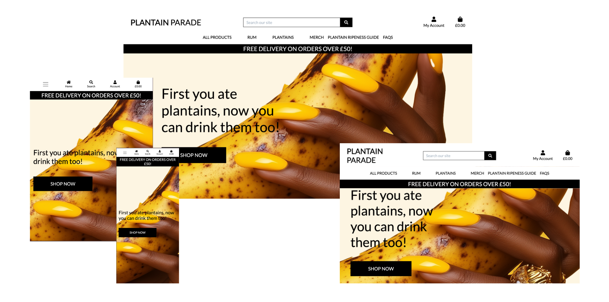
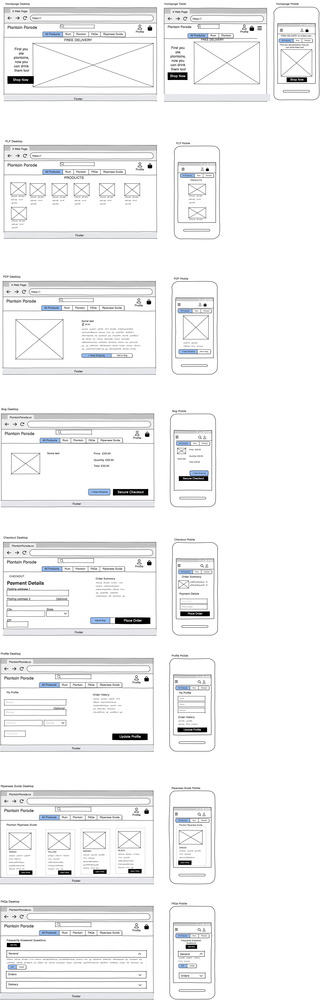
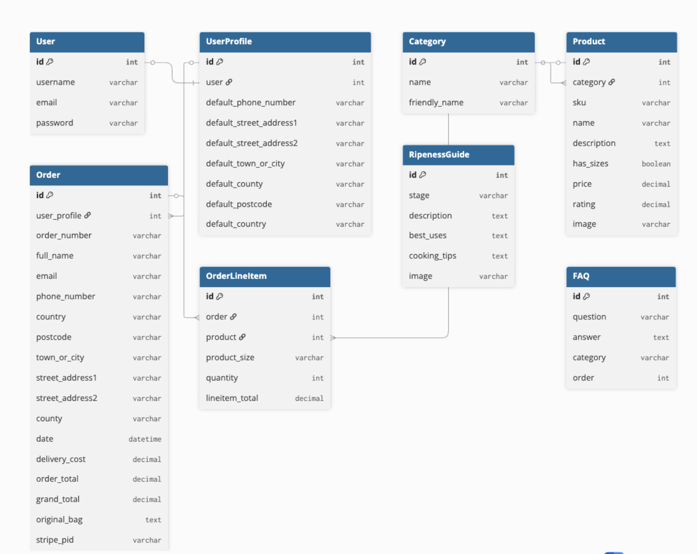

# Plantain Parade

An afro-centric inspired e-commerce store celebrating the cultural significance of plantain in West African and diaspora cooking. Founded by Nigerian immigrants with a deep love for fried plantain, Plantain Parade brings together DÒDÒ plantain-infused rum, fresh plantains and branded merchandise - honouring the ingredient that connects heritage and community.

The name DÒDÒ is the Yoruba word for fried sweet plantain and it sits at the heart of the brand. Plantain Parade is more than a shop; it's a celebration of Afro-Caribbean food culture and the joy of sharing it with the world.

**Live site:** [https://plantain-parade-cd90a7013f80.herokuapp.com](https://plantain-parade-cd90a7013f80.herokuapp.com)

**GitHub repository:** [https://github.com/YemsAla/plantain-parade](https://github.com/YemsAla/plantain-parade)

---

## Table of Contents

- [Project Goals](#project-goals)
- [User Stories](#user-stories)
- [Design](#design)
  - [Wireframes](#wireframes)
  - [Database Schema](#database-schema)
  - [Colour Scheme and Typography](#colour-scheme-and-typography)
  - [Features](#features)
- [Technologies Used](#technologies-used)
- [Testing](#testing)
- [Deployment](#deployment)
- [Credits](#credits)

---

## Project Goals

### External User Goals

- Browse and purchase plantain-inspired products including plantain-infused rum, fresh plantains and branded merchandise.
- Complete a secure checkout using Stripe payments.
- Create an account to save delivery information and view order history.
- Use the Plantain Ripeness Guide to understand which plantain stage suits their needs.
- Find answers to common questions via the FAQ section.

### Site Owner Goals

- Provide a fully functional e-commerce store to sell plantain & DÒDÒ branded products.
- Allow store owners to manage products, the Plantain Ripeness Guide and FAQs directly from the store-front without accessing the admin panel.
- Build brand awareness for DÒDÒ plantain-infused rum through an engaging online presence.

---

## User Stories

✅ = successfully implemented  
❌ = yet to be implemented

✅ 1. As a visitor, I want to browse all products without an account so that I can explore the store before registering.

✅ 2. As a visitor, I want to search and filter products by category so that I can find what I'm looking for quickly.

✅ 3. As a shopper, I want to view individual product details including price, description and image so that I can make an informed purchase decision.

✅ 4. As a shopper, I want to add products to my bag and adjust quantities so that I can manage my order before checkout.

✅ 5. As a shopper, I want to complete a secure checkout using my card so that I can purchase products safely.

✅ 6. As a shopper, I want to receive an order confirmation email so that I know my order was placed successfully.

✅ 7. As a user, I want to register for an account so that I can save my delivery information and view my order history.

✅ 8. As a registered user, I want to log in and out securely so that my account is protected.

✅ 9. As a registered user, I want to view my profile and update my default delivery information so that checkout is faster next time.

✅ 10. As a registered user, I want to view my past orders so that I can keep track of my purchase history.

✅ 11. As a visitor, I want to read the Plantain Ripeness Guide so that I can choose the right plantain for my recipe.

✅ 12. As a visitor, I want to browse the FAQs so that I can get answers to common questions without contacting support.

✅ 13. As a store owner, I want to add, edit and delete products from the storefront so that I can manage the product catalogue without using the admin panel.

✅ 14. As a store owner, I want to add, edit and delete Plantain Ripeness Guide entries so that I can keep the guide up to date.

✅ 15. As a store owner, I want to add, edit and delete FAQs so that I can manage customer information easily.

❌ 16. As a shopper, I want to save products to a wishlist so that I can return to them later.

❌ 17. As a user, I want a forgotten password option so that I can recover my account if I forget my credentials.

❌ 18. As a registered user, I want to upload a picture of myself to my account so that I can enhance my account identity.

---

## Design

### Wireframes

Wireframes were created using Balsamiq for desktop and mobile layouts across all key pages.

Pages covered:
- Homepage
- Product Listing Page
- Product Detail Page
- Shopping Bag
- Checkout
- Profile
- Plantain Ripeness Guide
- FAQs

---

### Database Schema

The database was designed using PostgreSQL and consists of 8 models across 6 apps.

**Models and Relationships:**

- One `User` has one `UserProfile` (one-to-one)
- One `UserProfile` can have many `Orders` (one-to-many)
- One `Order` can have many `OrderLineItems` (one-to-many)
- One `Product` can appear in many `OrderLineItems` (one-to-many)
- One `Category` can have many `Products` (one-to-many)
- `RipenessGuide` is a standalone custom model with no foreign key relationships
- `FAQ` is a standalone custom model with no foreign key relationships

**Custom Models:**

`RipenessGuide` — stores information about each plantain ripeness stage including description, best uses, cooking tips and an optional image. Full CRUD is available to superusers via the storefront.

`FAQ` — stores frequently asked questions grouped by category (Orders, Delivery, Products, Returns, General) with an order field to control display sequence. Full CRUD is available to superusers via the storefront.

---

### Colour Scheme and Typography

The site uses a warm cream background (`#FAF3E0`) with black text and black buttons to reflect the DÒDÒ brand identity — bold, premium and Caribbean-inspired.

**Typography:** The `Lato` font family is used throughout, imported via Google Fonts. Logo text uses a custom `logo-font` class for brand consistency.

---

## Features

### Existing Features

**Navigation**
A fully responsive navigation bar is present on all pages. On desktop it displays the logo, search bar, My Account dropdown and bag icon in the top row, with product category links in the second row. On mobile it collapses to a hamburger menu.

**Homepage**
A full-width hero section with brand tagline and a Shop Now CTA button. A free delivery banner displays across all pages.

**Products Page**
Displays all products as cards showing image, name, price, category and rating. Products can be filtered by category and sorted by price, rating or category. The count of results is shown.

**Product Detail Page**
Shows the full product details including image, name, price, category, rating, description and a quantity selector. Users can add the product to their bag or return to shopping.

**Shopping Bag**
Displays all items in the bag with quantity adjusters and remove buttons. Shows subtotal, delivery cost and grand total. Links to secure checkout.

**Checkout**
A two-column layout with delivery form on the left and order summary on the right. Logged-in users have their delivery information pre-filled. Stripe card payment integration. Save info checkbox to update profile on checkout.

**Checkout Success**
Displays a full order confirmation with order number, items, delivery address and totals. A confirmation email is sent via the webhook handler.

**User Authentication**
Registration, login and logout powered by Django Allauth. Email verification is set to mandatory. Login and logout redirect to the homepage.

**Profile Page**
Logged-in users can view and update their default delivery information. Order history is displayed in a table with links to past order confirmations.

**Product Management (Superusers)**
Store owners can add, edit and delete products directly from the storefront. Access is restricted to superusers via `@login_required` and `is_superuser` checks.

**Plantain Ripeness Guide**
A custom app displaying four plantain ripeness stages (Green, Yellow, Brown, Overripe) as cards. Each stage has a detail page with description, best uses and cooking tips formatted as bullet points. Superusers can add, edit and delete stages via the storefront.

**FAQs**
A custom app displaying frequently asked questions grouped by category in a Bootstrap accordion. Superusers can add, edit and delete FAQs via the storefront. 10 FAQs across 5 categories are live on the deployed site.

**Toast Notifications**
Success, error, warning and info messages display as toast notifications after all key user actions.

---

### Future Features

- Wishlist functionality for registered users
- Forgotten password / email-based account recovery
- Product reviews and ratings submitted by customers
- Stock management system
- Real email sending in production (currently using console backend)

---

## Technologies Used

### Languages

- Python 3.12
- HTML5
- CSS3
- JavaScript

### Frameworks and Libraries

| Package | Purpose |
|---------|---------|
| Django 6.0.6 | Main web framework |
| Bootstrap 4 | Front-end layout and components |
| django-allauth 0.50.0 | User authentication |
| django-crispy-forms + crispy-bootstrap4 | Form rendering |
| django-countries 7.6.1 | Country field for checkout and profile |
| django-storages 1.14.6 | AWS S3 file storage |
| Stripe 15.2.1 | Payment processing |
| boto3 | AWS SDK for Python |
| dj-database-url | Database URL parsing |
| psycopg2-binary | PostgreSQL adapter |
| Pillow | Image handling |
| Gunicorn | WSGI HTTP server for Heroku |

### Tools and Services

- **Git / GitHub** — version control
- **Heroku** — deployment platform
- **PostgreSQL (Neon/CI)** — production database
- **SQLite** — local development database
- **AWS S3** — media file storage
- **Stripe** — payment processing
- **VS Code** — code editor
- **Balsamiq** — wireframe creation
- **dbdiagram.io** — ERD creation

---

## Testing

Full testing documentation including manual tests, bug fixes and browser compatibility can be found in [TESTING.md](TESTING.md)

---

## Deployment

The project is deployed on **Heroku** using a PostgreSQL database provided by Code Institute (Neon) and AWS S3 for media file storage.

### Local Development Setup

1. Clone the repository: