# Plantain Parade — Testing

[Return to README](README.md)

## Table of Contents

- [Code Validation](#code-validation)
- [Manual Testing](#manual-testing)
  - [Authentication](#authentication)
  - [Products and Shopping Bag](#products-and-shopping-bag)
  - [Checkout and Payments](#checkout-and-payments)
  - [User Profile](#user-profile)
  - [Product Management](#product-management)
  - [Plantain Ripeness Guide](#plantain-ripeness-guide)
  - [FAQs](#faqs)
- [Bugs and Fixes](#bugs-and-fixes)
- [Known Issues](#known-issues)
- [Responsiveness](#responsiveness)
- [Browser Compatibility](#browser-compatibility)

---

## Code Validation

### HTML

All pages validated using the [W3C Nu HTML Checker](https://validator.w3.org/nu/) by direct URL input against the live Heroku website. Most errors on  pages are inherited from the Boutique Ado walkthrough base template and relate to Bootstrap 4 dropdown aria patterns, a duplicate `id="user-options"` across desktop and mobile navs, a FontAwesome kit placeholder script tag, and heading level skips in the delivery banner. None of these affect functionality. No errors were introduced by my custom app code.

| Page | URL | Result |
|------|-----|--------|
| Homepage | `/` | Errors present - inherited from Boutique Ado base template (see notes above) |
| Products | `/products/` | Errors present - inherited from Boutique Ado base template |
| Product Detail | `/products/1/` | Errors present - inherited from Boutique Ado base template |
| Shopping Bag | `/bag/` | Errors present - inherited from Boutique Ado base template |
| Checkout | `/checkout/` | Errors present - inherited from Boutique Ado base template |
| Profile | `/profile/` | Errors present - inherited from Boutique Ado base template |
| Plantain Ripeness Guide | `/ripeness-guide/` | Errors present - inherited from Boutique Ado base template |
| FAQs | `/faqs/` | Errors present - inherited from Boutique Ado base template + Bootstrap accordion aria pattern |

### HTML

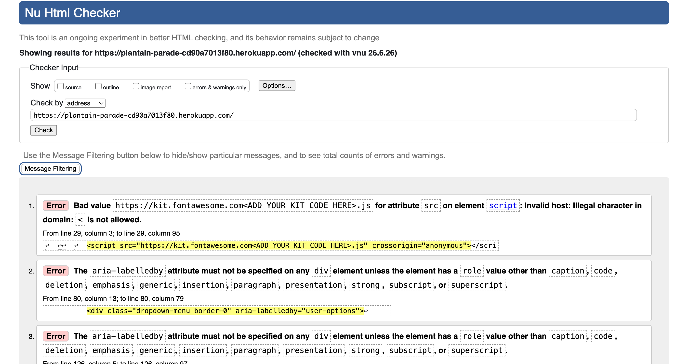
### CSS

| File | Result |
|------|--------|
| base.css | No errors found |

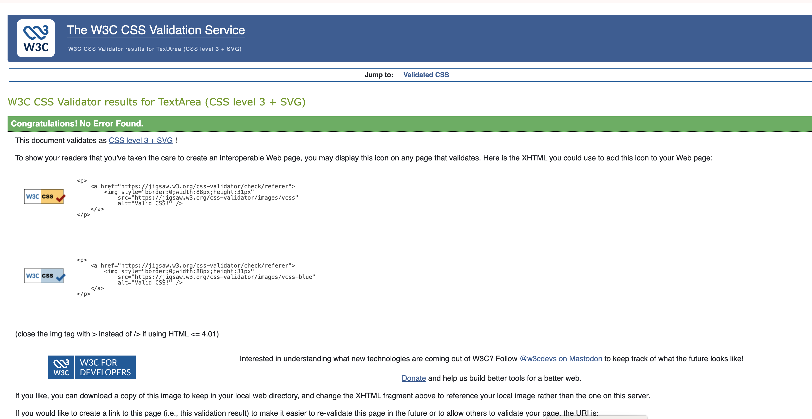

| File | Result |
|------|--------|
| profile.css | No errors found |

### JavaScript

| File | Result |
|------|--------|
| stripe_elements.js | No errors |

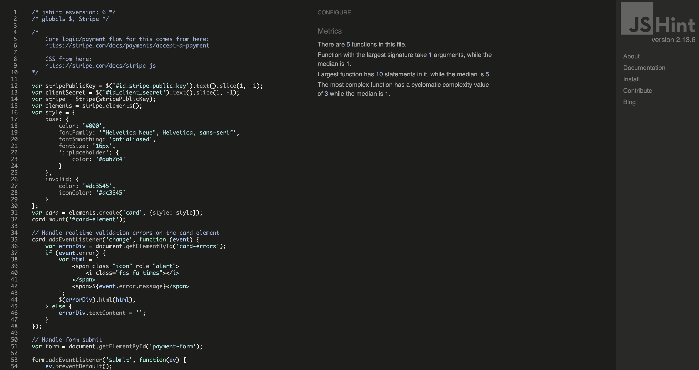

| File | Result |
|------|--------|
| countryfield.js | No errors |

### Python (PEP8)

All files validated using Flake8 (`python3 -m flake8 --exclude .venv,.vscode,migrations`). Walkthrough-based files contain known style issues inherited from Boutique Ado and were not modified to avoid introducing bugs. Custom app files (faqs and plantain_ripeness_guide) were fully fixed to PEP8 standard.

| File | Result |
|------|--------|
| checkout/views.py | Walkthrough file - line length and whitespace warnings inherited from Boutique Ado |
| checkout/models.py | Walkthrough file - line length and whitespace warnings inherited from Boutique Ado |
| checkout/webhook_handler.py | Walkthrough file - line length and whitespace warnings inherited from Boutique Ado |
| profiles/views.py | Walkthrough file - line length warnings inherited from Boutique Ado |
| profiles/models.py | Walkthrough file - line length warnings inherited from Boutique Ado |
| products/views.py | Walkthrough file - line length and whitespace warnings inherited from Boutique Ado |
| products/models.py | Walkthrough file - line length warnings inherited from Boutique Ado |
| bag/contexts.py | Walkthrough file - line length and whitespace warnings inherited from Boutique Ado |
| plantain_ripeness_guide/views.py | No errors |
| plantain_ripeness_guide/models.py | No errors |
| faqs/views.py | No errors |
| faqs/models.py | No errors |

---

## Manual Testing

### Authentication

| Test | Expected Result | Actual Result | Pass/Fail |
|------|----------------|---------------|-----------|
| Register with valid credentials | Redirected to homepage with success message | As expected | ✅ Pass |
| Register with mismatched passwords | Error message shown | As expected | ✅ Pass |
| Register with existing username | Error message shown | As expected | ✅ Pass |
| Login with valid credentials | Redirected to homepage, nav updates | As expected | ✅ Pass  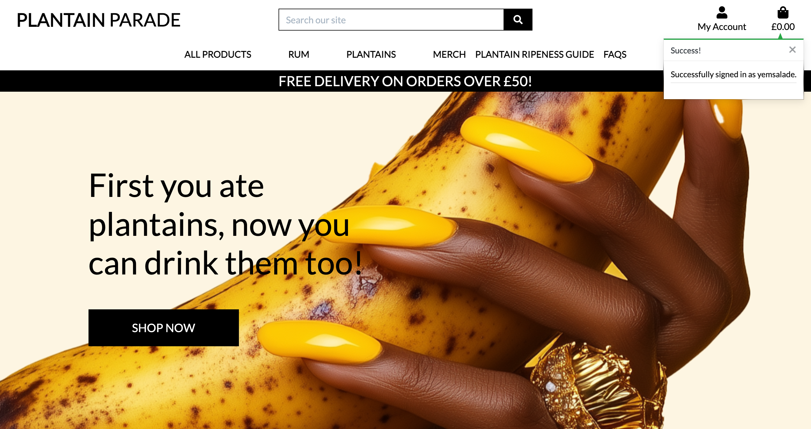 |
| Login with wrong password | Error message shown, stays on login page | As expected | ✅ Pass |
| Logout | Redirected to homepage, nav shows Login/Register | As expected | ✅ Pass |
| Access profile page when logged out | Redirected to login page | As expected | ✅ Pass |
| Access product management when not superuser | Redirected with error message | As expected | ✅ Pass |

---

### Products and Shopping Bag

| Test | Expected Result | Actual Result | Pass/Fail |
|------|----------------|---------------|-----------|
| Browse all products | All products display as cards | As expected | ✅ Pass 
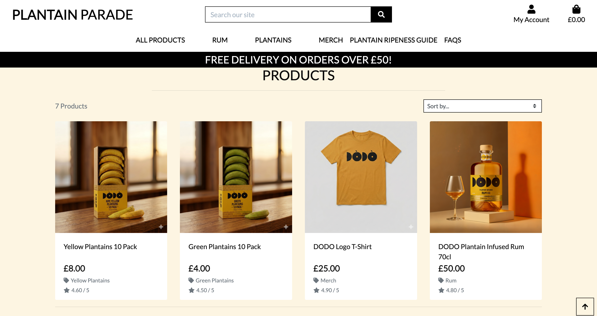 |
| Filter by category (Rum) | Only rum products shown | As expected | ✅ Pass |
| Sort by price low to high | Products reorder correctly | As expected | ✅ Pass |
| Sort by rating | Products reorder correctly | As expected | ✅ Pass |
| Search by keyword | Matching products shown | As expected | ✅ Pass |
| Search with no results | "0 products found" message shown | As expected | ✅ Pass |
| View product detail | Full detail page loads | As expected | ✅ Pass |
| Add product to bag | Success toast shows with bag contents | As expected | ✅ Pass |
| Adjust quantity in bag | Quantity updates, totals recalculate | As expected | ✅ Pass |
| Remove item from bag | Item removed, totals update | As expected | ✅ Pass |
| Empty bag | Message shown, no checkout button | As expected | ✅ Pass |
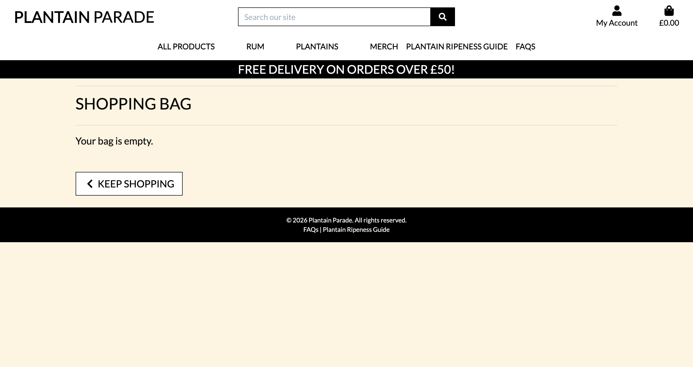 |

---

### Checkout and Payments

| Test | Expected Result | Actual Result | Pass/Fail |
|------|----------------|---------------|-----------|
| Checkout with valid card (4242 4242 4242 4242) | Order placed, redirected to success page | As expected | ✅ Pass | 
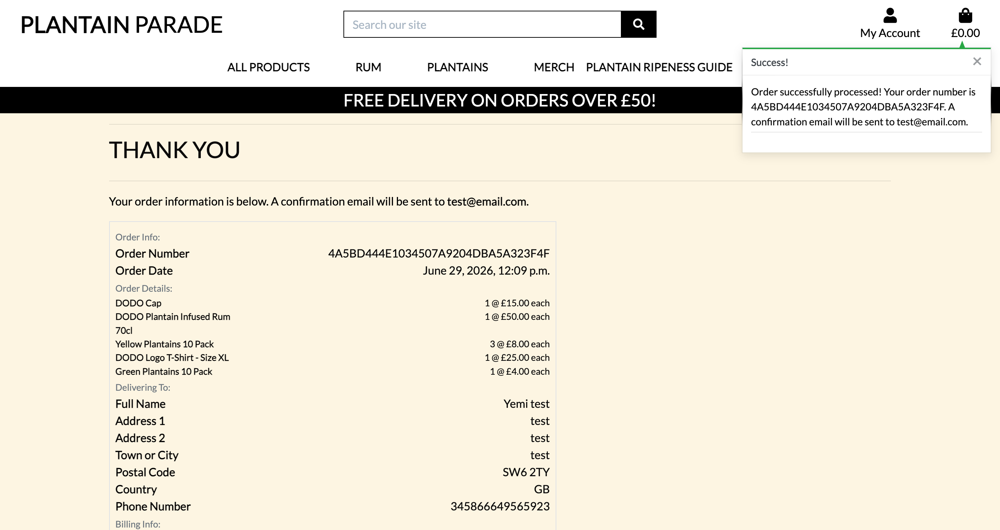
| Checkout with invalid card | Error message shown below card field | As expected | ✅ Pass |
| Checkout with empty form fields | Validation errors shown | As expected | ✅ Pass |
| Logged in user checkout | Form pre-filled with profile data | As expected | ✅ Pass |
| Save info checkbox checked | Profile updated with checkout details | As expected | ✅ Pass |
| Order confirmation page loads | Order number, items and totals shown | As expected | ✅ Pass |
| Confirmation email received | Email sent to registered address | As expected | ✅ Pass |
| Webhook payment_intent.succeeded | 200 response in Stripe dashboard | As expected | ✅ Pass |

---

### User Profile

| Test | Expected Result | Actual Result | Pass/Fail |
|------|----------------|---------------|-----------|
| View profile page | Delivery form and order history shown | As expected | ✅ Pass 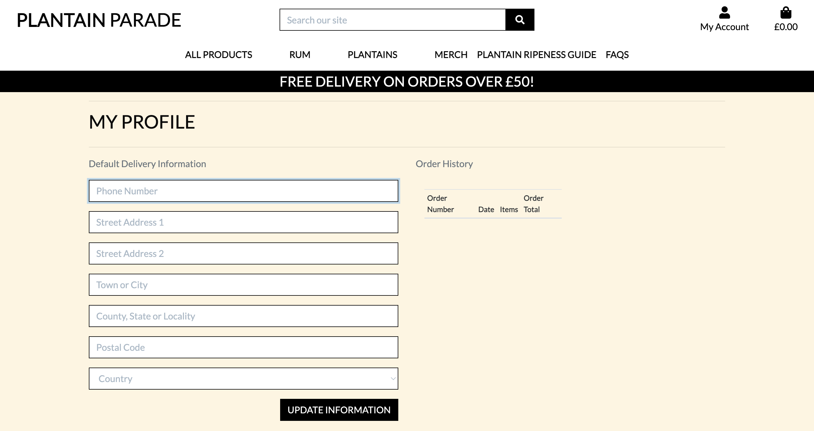
| Update delivery information | Success message, form saves | As expected | ✅ Pass |
| View order history | Past orders shown in table | As expected | ✅ Pass |
| Click order number in history | Past order confirmation page loads | As expected | ✅ Pass |
| Info toast on past order page | Message shown without bag contents | As expected | ✅ Pass |

---

### Product Management (Superuser only)

| Test | Expected Result | Actual Result | Pass/Fail |
|------|----------------|---------------|-----------|
| Product Management link visible to superuser | Link appears in My Account dropdown | As expected | ✅ Pass |
| Product Management link hidden from regular users | Link not visible | As expected | ✅ Pass |
| Add a product | Product saved, redirected to product detail | As expected | ✅ Pass 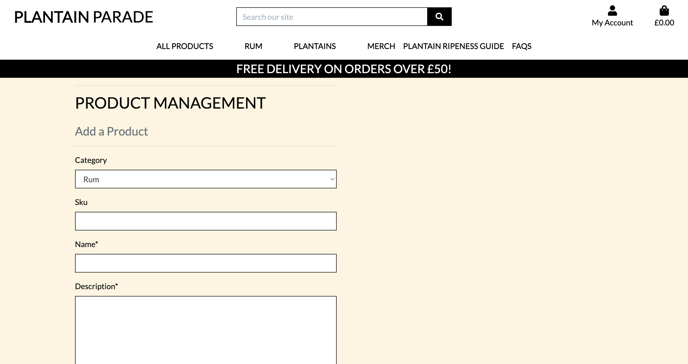
| Add product with invalid price | Validation error shown | As expected | ✅ Pass 
| Edit a product | Form pre-filled, updates on save | As expected | ✅ Pass |
| Delete a product | Product removed, redirected to products | As expected | ✅ Pass |
| Non-superuser accesses /products/add/ directly | Redirected with error message | As expected | ✅ Pass |

---

### Plantain Ripeness Guide

| Test | Expected Result | Actual Result | Pass/Fail |
|------|----------------|---------------|-----------|
| View ripeness guide | All stages shown as cards in correct order (Green, Yellow, Brown, Overripe) | As expected | ✅ Pass 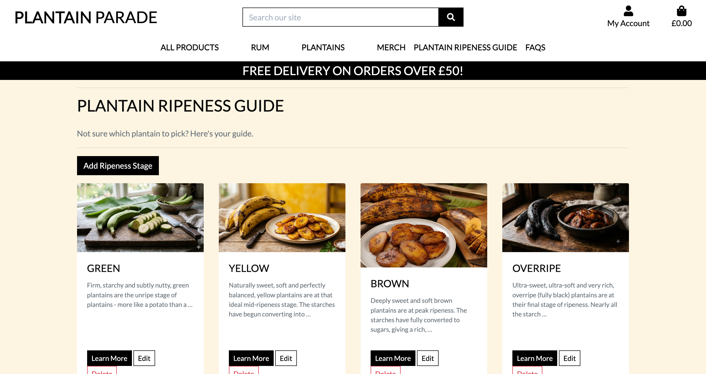
| Click Learn More | Detail page loads with correct content | As expected | ✅ Pass |
| Best uses and cooking tips show as bullet points | Bullet list renders correctly | As expected | ✅ Pass |
| Add stage (superuser) | Stage saved, redirected to guide | As expected | ✅ Pass |
| Edit stage (superuser) | Form pre-filled, updates on save | As expected | ✅ Pass |
| Delete stage (superuser) | Confirmation page shown, then deleted | As expected | ✅ Pass |
| Add/Edit/Delete links hidden from regular users | Links not visible | As expected | ✅ Pass |
| Non-superuser accesses /ripeness-guide/add/ directly | Redirected with error message | As expected | ✅ Pass |

---

### FAQs

| Test | Expected Result | Actual Result | Pass/Fail |
|------|----------------|---------------|-----------|
| View FAQs page | Accordion with categories shown | As expected | ✅ Pass |
| Click category header | Accordion opens/closes | As expected | ✅ Pass |
| Add FAQ (superuser) | FAQ saved, success toast without bag | As expected | ✅ Pass |
| Edit FAQ (superuser) | Form pre-filled, updates on save | As expected | ✅ Pass |
| Delete FAQ (superuser) | Confirmation page shown, then deleted | As expected | ✅ Pass 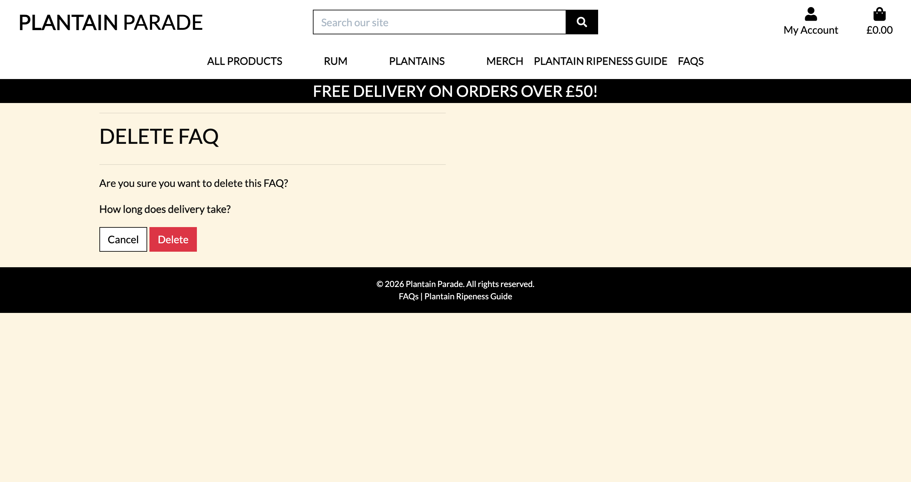
| Add/Edit/Delete buttons hidden from regular users | Buttons not visible | As expected | ✅ Pass |
| Non-superuser accesses /faqs/add/ directly | Redirected with error message | As expected | ✅ Pass |

---

## Bugs and Fixes

| Bug | Fix |
|-----|-----|
| `.venv` folder committed to GitHub causing Heroku build failure | Ran `git rm --cached -r .venv/` and added `.venv/` to `.gitignore` |
| `crispy_bootstrap4` module not found on Heroku | Installed `crispy-bootstrap4` and added to `requirements.txt` and `INSTALLED_APPS` |
| Profile form fields not rendering with `{{ form\|crispy }}` | Installed `crispy-bootstrap4` package which is required separately in newer versions |
| Stripe webhook returning 500 on `payment_intent.succeeded` | Fixed typo `request.user.usdername` → `request.user.username` in `cache_checkout_data` |
| `UserProfile.DoesNotExist` error in webhook handler | Changed `UserProfile.objects.get()` to `UserProfile.objects.get_or_create()` |
| Delete confirmation not showing before deleting ripeness stage | Changed delete link from `<a>` tag to a `<form method="GET">` so it hits the view as GET before POST |
| Success toast showing bag contents on FAQs page | Added `on_faqs_page: True` to FAQs view context and updated toast condition |
| Success toast showing bag contents on profile page | Added `on_profile_page: True` to profile view context and updated toast condition |
| Django 6 incompatibile with `django-countries 7.2.1` | Upgraded to `django-countries 7.6.1` |
| Static files not serving on Heroku (AWS S3 incompatible with Django 6) | Replaced AWS S3 with Whitenoise (`CompressedManifestStaticFilesStorage`) for static files |
| Media files not serving on Heroku | Replaced AWS S3 with Cloudinary (`MediaCloudinaryStorage`) for media file storage |
| Hero text overlapping delivery banner on mobile (375px) | Changed hero column from `col-7` to `col-12` on mobile and reduced heading from `display-3` to `display-4` |
| No way to return to homepage on mobile (logo hidden on small screens) | Added Home icon link as first item in `mobile-top-header.html` |
| Ripeness guide cards displayed in wrong alphabetical order | Added `order` field to `RipenessGuide` model with `Meta: ordering = ['order']`, set values Green=1, Yellow=2, Brown=3, Overripe=4 |
| Stripe webhook not configured on Heroku | Added Heroku endpoint in Stripe dashboard pointing to `/checkout/wh/`, added `STRIPE_WH_SECRET` to Heroku config vars |

---

## Known Issues

| Issue | Notes |
|-------|-------|
| Shopping bag table slightly cut off on screens below 375px | However users are able to scroll horizontally to see full info. The full mobile grid refactor was deferred due to time constraints. Noted as a future improvement. |
| Bag icon partially clipped on mobile nav at 320px | Five nav items are tight at 320px. All items remain accessible. Future fix would reduce icon sizes. |
| `aria-labelledby` on Bootstrap 4 dropdown divs | Bootstrap 4 pattern inherited from Boutique Ado walkthrough. Doesn't affect functionality. 
| FontAwesome kit script placeholder in base.html | The `<ADD YOUR KIT CODE HERE>` placeholder causes an HTML validation error. Icons load correctly via a separate CDN stylesheet. |
| No custom 404 page | Invalid URLs return Heroku's default error page. A custom 404 template is planned as a future improvement. |

---

## Responsiveness

Tested across mobile (375px), tablet (768px) and desktop (1440px).

| Breakpoint | Result |
|-----------|--------|
| Mobile (375px) | Navbar collapses to hamburger. Products stack to single column. Checkout form stacks. |
| Tablet (768px) | Navbar collapses to hamburger. Products show 2 columns. |
| Desktop (1440px+) | Full nav visible. Products show 4 columns. Two-column checkout layout. |

---

## Browser Compatibility

| Browser | Result | Notes |
|---------|--------|-------|
| Chrome | ✅ Pass | All pages render and function correctly |
| Edge | Not tested | Deferred to future iteration |
| Firefox | Not tested | Deferred to future iteration  |
| Safari | ✅ Pass | All pages render and function correctly |

---

[Return to README](README.md)
